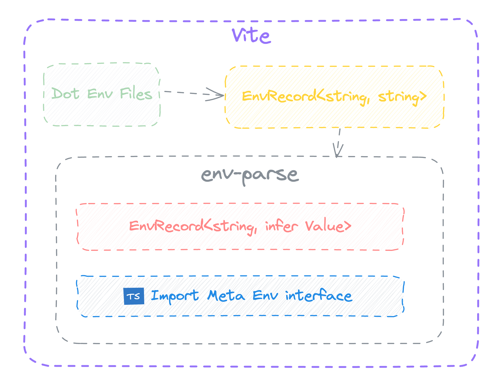

[简体中文](./README.zh.md)

Parse env string values to correct values, not all values are strings. And automatically generate ImportMetaEnv



## 📦 Install

```shell
npm i vite-plugin-env-parse -D

# yarn
yarn add vite-plugin-env-parse -D

# pnpm
pnpm add vite-plugin-env-parse -D
```

## 🦄 Usage

Add envParse plugin to vite.config.js / vite.config.ts and configure it:

```ts
// vite.config.js / vite.config.ts
import { envParse } from 'vite-plugin-env-parse'

export default {
  plugins: [envParse()]
}
```

Add include configuration to the `tsconfig.json` file.

> Ignore this step if the project `tsconfig.json` `include` configuration already contains `*.d.ts`
> 
```json
{
  "include": ["env.d.ts"]
}
```

[Example](./example)

## API

### Method

The `parseLoadedEnv` utility function can be used in the `vite config` file to parse the env environment variable values.

```ts
// vite.config.ts
import { parseLoadedEnv } from 'vite-plugin-env-parse'
import { defineConfig, loadEnv } from 'vite'

export default defineConfig(({ mode }) => {
  console.log('vite.config.ts', parseLoadedEnv(loadEnv(mode, './')))

  return {
    plugins: [envParse({})]
  }
})
```

### EnvParseOptions

| Property       | Type                | Description                                                                        |
| -------------- | ------------------- | ---------------------------------------------------------------------------------- |
| `exclude`      | `string[]`          | A list of environment variable keys to exclude from parsing. Optional.             |
| `parseJson`    | `boolean`           | Whether to parse JSON strings into JSON objects. Defaults to `true`. Optional.     |
| `customParser` | `CustomTransformer` | A custom transformer function for parsing environment variables. Optional.         |
| `dtsPath`      | `string`            | The file path for generating the `.d.ts` file. Defaults to `'env.d.ts'`. Optional. |

## License

[MIT licenses](https://opensource.org/licenses/MIT)
